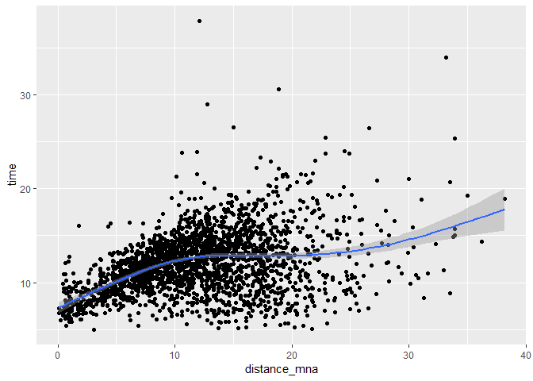
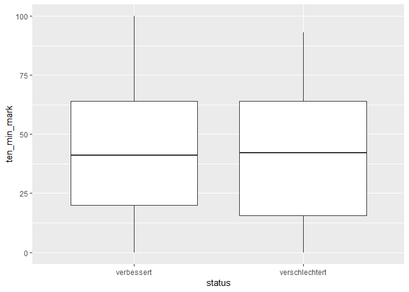

German Rescue Services data
================
Fabio Votta

This script is about:

Getting data from German Rescue services.

## Packages and Folders

``` r
# Install these packages if you don't have them yet
# if (!require("pacman")) install.packages("pacman")
# devtools::install_github("favstats/tidytemplate")

pacman::p_load(tidyverse, tidytemplate, rvest, RSelenium, glue, crayon)

# Creates folders
# tidytemplate::data_dir()
# tidytemplate::images_dir()
```

## Rselenium Set Up

``` r
port <- sample(4000L:5000L, 1)
rD <- rsDriver(verbose = FALSE, port = port)

remDr <- rD$client

# url <- "https://www.swr.de/swraktuell/Rettungsdienst-weiter-ueberlastet-Im-Notfall-sind-hunderte-Gemeinden-nicht-ausreichend-versorgt,rettungsdienst-bei-hilfe-im-notfall-ueberlastet-100.html?search=Aach%20(Kreis%20Trier-Saarburg)"
# remDr$navigate(url)
```

## Get City Names

``` r
lettercodes <- bind_cols(l1 = letters, l2 = letters) %>% 
  expand.grid() %>% 
  mutate(lettcode = paste0(l1, l2)) %>% 
  select(-l1, -l2)
 

get_city_list <- function(keys) {
  
message(round((which(keys == lettercodes$lettcode) / length(lettercodes$lettcode))*100, 2), "%\n")  
  
  remDr$findElement(using = "xpath", '//*[(@id = "search")]')

  remDr$sendKeysToActiveElement(list(keys))
  
    # remDr$sendKeysToActiveElement(list("aa"))

  
  # city_list <- remDr$getPageSource() %>% 
  #   magrittr::extract2(1) %>% 
  #   read_html() %>% 
  #   # html_nodes("#ui-id-1") %>% 
  #   html_nodes(".ui-menu-item") %>% 
  #   html_text()
  
Sys.sleep(1)
  
  
  remDr$sendKeysToActiveElement(list("\ue003"))
  remDr$sendKeysToActiveElement(list("\ue003"))


  remDr$sendKeysToActiveElement(list(keys))
  
    # remDr$sendKeysToActiveElement(list("aa"))

  
  city_list <- remDr$getPageSource() %>% 
    magrittr::extract2(1) %>% 
    read_html() %>% 
    # html_nodes("#ui-id-1") %>% 
    html_nodes(".ui-menu-item") %>% 
    html_text()
  
Sys.sleep(1)
  
  
  remDr$sendKeysToActiveElement(list("\ue003"))
  remDr$sendKeysToActiveElement(list("\ue003"))

  return(city_list)
}

# get_city_list("sd")
# get_city_list("")

city_names <- lettercodes$lettcode %>% 
  map(get_city_list) %>% 
  flatten() %>% as.character()

tidytemplate::save_it(city_names)

## manche Städte haben nicht genug Daten und müssen geskipped werden

city_names <- tidytemplate::load_it("data/city_names.Rdata")

city_urls <- city_names %>%
  discard(str_detect(., "Zu Ihrer Eingabe wurden keine Ergebnisse gefunden.")) %>% 
  str_replace_all(pattern = " ", "%20") %>% 
  paste0("?search=", .)
```

## Get Emergency Data

``` r
# rm(key)
# key <- city_urls[41]

get_gemeinde <- function(key) {
  url <- glue("https://www.swr.de/swraktuell/Rettungsdienst-weiter-ueberlastet-Im-Notfall-sind-hunderte-Gemeinden-nicht-ausreichend-versorgt,rettungsdienst-bei-hilfe-im-notfall-ueberlastet-100.html{key}")

remDr$navigate(url)

Sys.sleep(1.5)

page_source <- remDr$getPageSource() %>% 
  magrittr::extract2(1) %>% 
  read_html() 

not_available <- page_source %>%
  html_nodes(".zitat-box:nth-child(2) .zitat-text") %>%
  html_text() %>%
  str_detect("zu wenige Einsätze für eine Analyse gegeben")

if (not_available) return(NULL)

cleaned_key <- str_replace_all(key, pattern = "%20", " ") %>%
  str_remove("\\?search=")

current_case <- which(key == city_urls)

message(paste0(current_case, " out of ", length(city_urls), " (", round((current_case / length(city_urls))*100, 2), "%)\n")) 

paragraph_data <- page_source %>% 
  html_nodes("#result > div > p:nth-child(3)") %>% 
  html_nodes("strong") %>% 
  as.character() %>% 
  str_remove("<strong>") %>% 
  str_remove("</strong>") %>% 
  str_remove("\\*") %>% 
  str_remove("%") %>% 
  str_trim() %>% 
  tibble(time = .) %>% t %>% 
  as_tibble() %>% 
  set_names(c("time", "10_min_mark", "15_min_miss", "status"))

table_data <- page_source %>% 
  html_nodes(".table-responsive") %>% 
  html_nodes("table") %>% 
  html_table() %>% 
  .[[1]] %>% 
  set_names(.[1,]) %>% 
  .[-1,] %>% 
  janitor::clean_names() %>% 
  gather(key, value, -blaulicht_einsatze) %>% 
  t() %>% 
  as_tibble() %>%
  set_names(paste(.[1,], .[2,])) %>% 
  janitor::clean_names() %>% 
  # rename_if(str_detect(., "x2016"), function(x) x <- "rtw_17")
  # rename(rtw_16 = V1, rtw_17 = V3, nef_16 = V2, nef_17 = V4) %>% 
  .[-1:-2,] 

distance_mna <- page_source %>% 
  html_nodes("#result p:nth-child(8)") %>% 
  as.character() %>% 
  str_match("in (.*?) km") %>% 
  .[,2] %>% as.numeric()

final_set <- bind_cols(paragraph_data, table_data) %>% 
  mutate(distance_mna = distance_mna) %>% 
  mutate(gemeinde = cleaned_key) %>% 
  select(gemeinde, everything())


cat(glue("Notfälle in {red$bold(cleaned_key)} können damit rechnen, dass der Rettungsdienst innerhalb von {green$bold(final_set$time)} eintrifft.\n"))

if (magrittr::not(current_case %% 10 > 0)) cat(Sys.time() - time_now)
  
  


return(final_set)
}

# get_gemeinde(city_urls[1553])

time_now <- Sys.time() 


safe_gemeinde <- purrr::safely(get_gemeinde)


gemeinde_daten <- city_urls %>% 
  map(safe_gemeinde)


tidytemplate::save_it(gemeinde_daten)
```

### Fixing some Missings

``` r
index_missing <- gemeinde_daten %>% 
  map("error") %>% 
  map(is.null)%>% 
  flatten() %>% as.logical() %>%  magrittr::not(.) 


gemeinde_missing <- city_urls[index_missing] %>% 
  map(safe_gemeinde)

notfall_dat <- bind_rows(

gemeinde_daten %>% 
  map("result") %>% 
  bind_rows(),

gemeinde_missing %>% 
  map("result") %>% 
  bind_rows()

) %>% 
  full_join(tibble(gemeinde = city_names))
```

### Data Cleaning

``` r
notfall_dat <- notfall_dat %>% 
  rename(ten_min_mark = `10_min_mark`,
         fifteen_min_miss = `15_min_miss`,
         rtw_16 = rettungswagen_x2016,
         rtw_17 = rettungswagen_x2017,
         nef_16 = notarzt_x2016,
         nef_17 = notarzt_x2017) %>% 
  tidyr::separate(time, into = c("minutes", "seconds"), sep = ":") %>% 
  mutate(minutes = parse_number(minutes)) %>% 
  mutate(seconds = parse_number(seconds) / 60) %>% 
  mutate(time = minutes + seconds) %>%
  mutate_at(vars(ten_min_mark, 
                 fifteen_min_miss, 
                 rtw_16, 
                 rtw_17, 
                 nef_16, 
                 nef_17), parse_number) %>% 
  select(gemeinde, time, everything())

tidytemplate::save_it(notfall_dat)
```

## Data Exploring and Dataviz

``` r
notfall_dat <- tidytemplate::load_it("data/notfall_dat.Rdata")
```

### Fastest Regions

``` r
notfall_dat %>% 
  arrange(time)
```

    ## # A tibble: 3,435 x 12
    ##    gemeinde  time minutes seconds ten_min_mark fifteen_min_miss status
    ##    <chr>    <dbl>   <dbl>   <dbl>        <dbl>            <dbl> <chr> 
    ##  1 Helmenz~  5.02       5  0.0167           83                7 versc~
    ##  2 Erolzhe~  5.05       5  0.05             84                5 versc~
    ##  3 Merklin~  5.15       5  0.15             87                5 versc~
    ##  4 Wehingen  5.17       5  0.167            81                9 versc~
    ##  5 Arzfeld   5.22       5  0.217            70               14 versc~
    ##  6 Horhaus~  5.27       5  0.267            77               10 versc~
    ##  7 Adenau    5.42       5  0.417            81                8 versc~
    ##  8 Herschb~  5.42       5  0.417            82                7 versc~
    ##  9 Echtern~  5.43       5  0.433            76               11 versc~
    ## 10 Speicher  5.45       5  0.45             83                7 versc~
    ## # ... with 3,425 more rows, and 5 more variables: rtw_16 <dbl>,
    ## #   nef_16 <dbl>, rtw_17 <dbl>, nef_17 <dbl>, distance_mna <dbl>

### Slowest Regions

``` r
notfall_dat %>% 
  arrange(desc(time))
```

    ## # A tibble: 3,435 x 12
    ##    gemeinde  time minutes seconds ten_min_mark fifteen_min_miss status
    ##    <chr>    <dbl>   <dbl>   <dbl>        <dbl>            <dbl> <chr> 
    ##  1 Dedenba~  37.8      37  0.833             2               17 verbe~
    ##  2 Sevenig~  33.9      33  0.933             0               87 verbe~
    ##  3 Sauerth~  30.6      30  0.55             24               13 verbe~
    ##  4 Lierfeld  29.0      28  0.967            21               56 verbe~
    ##  5 Fretten~  26.5      26  0.517             2               32 verbe~
    ##  6 Lottste~  26.4      26  0.417             0              100 verbe~
    ##  7 Gebroth   25.4      25  0.45              0               97 verbe~
    ##  8 Genting~  25.4      25  0.367             0              100 versc~
    ##  9 Heiligk~  24.0      24  0.0167            0               99 versc~
    ## 10 Kellenb~  23.9      23  0.933             2               75 verbe~
    ## # ... with 3,425 more rows, and 5 more variables: rtw_16 <dbl>,
    ## #   nef_16 <dbl>, rtw_17 <dbl>, nef_17 <dbl>, distance_mna <dbl>

``` r
notfall_dat %>% 
  ggplot(aes(distance_mna, time)) +
  geom_point() +
  geom_smooth()
```

    ## `geom_smooth()` using method = 'gam' and formula 'y ~ s(x, bs = "cs")'

    ## Warning: Removed 1128 rows containing non-finite values (stat_smooth).

    ## Warning: Removed 1128 rows containing missing values (geom_point).

<!-- -->

``` r
  # geom_density()

notfall_dat %>% 
  arrange(time) %>% 
  drop_na(status) %>% 
  ggplot(aes(status, ten_min_mark)) +
  geom_boxplot()
```

<!-- -->
